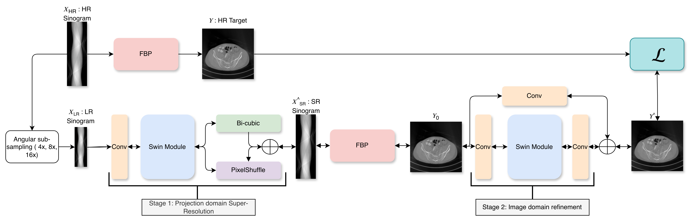

# DUDO Swin


This repository provides a simple implementation of the DUDO model for dual-domain processing.

## Find Projections Data here (AAPM Low-Dose)
https://www.kaggle.com/datasets/bipinyadav007/sinogram-thesis-data 
- Download projections from above and save it in a folder.

## Steps to Use

### 1. Edit the Configuration File
Install dependencies and Update the configuration file with the desired scale and path settings. Ensure all paths and parameters are correctly set before proceeding.
- Install required dependencies
```bash
pip install -r requirements.txt
```
- Install torch-radon using below command in terminal
```bash
# Install torch-radon using below command in terminal
git clone https://github.com/AstoundReddy/Torch-radon.git
cd Torch-radon
python -m build 
# If nvcc error: 
# Check CUDA version installed: ls /usr/local | grep cuda
# Run: export CUDA_HOME=/usr/local/cuda-11.2 #Change version accordingly
# Re-build: python -m build
pip install .
```
- Change below in config.py

```bash
SCALE = 16 #Set scale for e.g.{4,8,16,32}
# Base directory
BASE_DIR = Path("/cluster/du78sywa/")


# Base directory for the project.
BASE_DIR_PROJECT = Path("/cluster/du78sywa/model_dual_domain/dudo_simple")

# Directory where your raw projection TIFFs are stored
# e.g., /cluster/du78sywa/data/projections/L014_hd_proj_fan_geometry.tif
PROJ_DIR = BASE_DIR / "data" / "projections"
```
### 2. Preprocess the Data
Run the preprocessing.py script in dataloader to prepare the data for training:
```bash
python preprocess.py
```

### 3. Train the Model
Train the model using the following command:
```bash
python train.py
```

### 4. Test the Model
Evaluate the trained model using:
```bash
python test.py
```

## Notes
- Ensure all dependencies are installed before running the scripts. 
